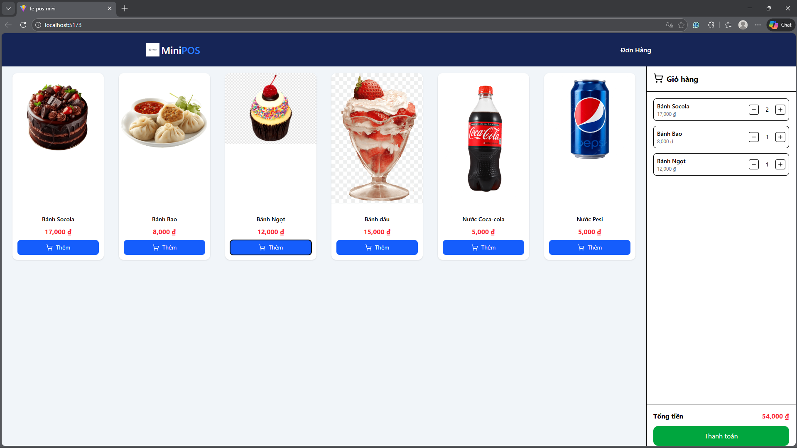
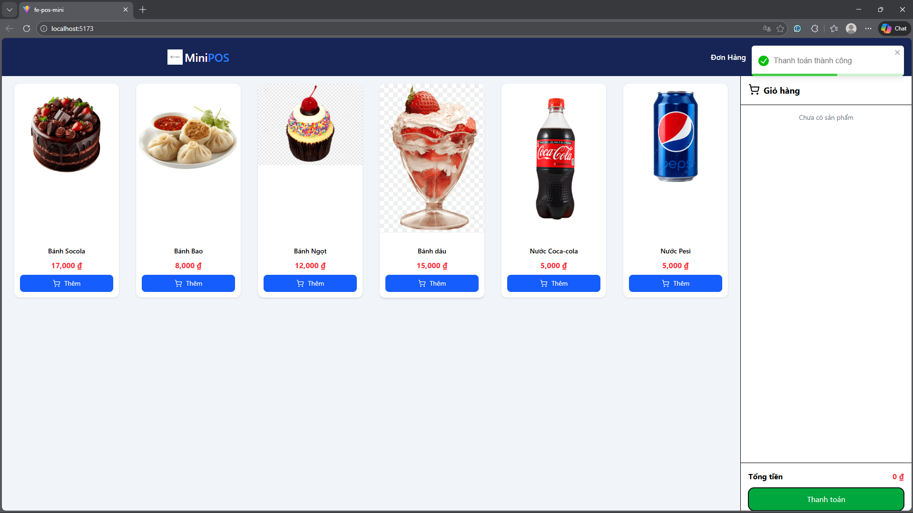
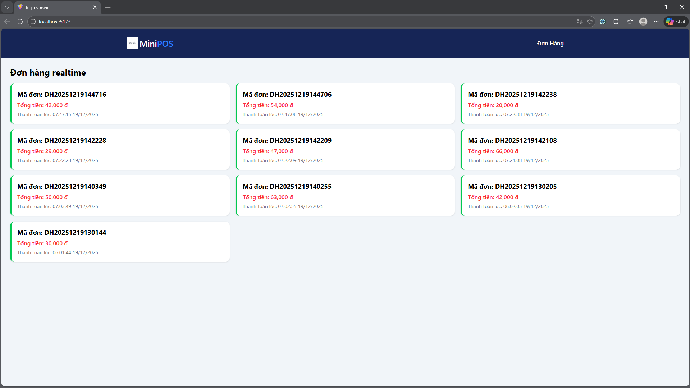

# POS Mini Project

Dự án **pos-mini** là một hệ thống POS (Point of Sale) mini gồm 2 phần chính:

* **fe-pos-mini**: Frontend (ReactJS)
* **be-pos-mini**: Backend (ASP.NET Core Web API)

Cả hai phần đều hỗ trợ chạy bằng **Docker**.

---

## 1. Yêu cầu hệ thống

Trước khi chạy dự án, đảm bảo máy của bạn đã cài:

* Git
* Docker
* Docker Compose

Kiểm tra nhanh:

```bash
docker --version
docker compose version
```

---

## 2. Clone source code từ GitHub

```bash
git clone https://github.com/quocdatend/pos-mini.git
cd pos-mini
```

---

## 3. Chạy Frontend (fe-pos-mini)

### 3.1 Chạy bằng Docker

Di chuyển vào thư mục frontend:

```bash
cd fe-pos-mini
```

Build image:

```bash
docker build -t fe-pos-mini:dev .
```

Chạy container:

```bash
docker run -p 5173:5173 fe-pos-mini:dev
```

Sau khi chạy:

* Frontend: `http://localhost:5173`

---

## 4. Chạy Backend (be-pos-mini)

### 4.1 Chạy Backend bằng Docker Compose

Di chuyển vào thư mục backend:

```bash
cd be-pos-mini
```

Build và chạy container:

```bash
docker compose up --build
```

Sau khi chạy thành công:

* Backend API: `http://localhost:8080`
* SQL Server: `localhost:1433`

EF Core sẽ tự động chạy `Database.Migrate()` khi app start.

---

### 4.2 Dừng Backend (nếu muốn tắt thay vì thủ công trên docker)

```bash
docker compose down
```

---

## 5. Công nghệ sử dụng

### Backend

* ASP.NET Core 8
* Entity Framework Core
* SQL Server
* SignalR (Realtime)
* Docker

### Frontend

* ReactJS
* Vite
* Axios
* Docker

---

## 6. Hình ảnh minh họa các màn hình

---

### 1️⃣ Màn hình bán hàng (POS Screen)

**Chức năng:**

* Hiển thị danh sách sản phẩm (Tên, Giá)
* Thêm sản phẩm vào giỏ hàng
* Hiển thị tổng tiền
* Nút Thanh toán




---

### 2️⃣ Màn hình khi Thanh toán

**Chức năng:**

* Gửi yêu cầu thanh toán lên Backend
* Hiển thị thông báo *Thanh toán thành công*
* Tự động clear giỏ hàng



---

### 3️⃣ Màn hình phụ – Realtime Screen

**Chức năng:**

* Hiển thị danh sách đơn hàng realtime
* Tự động cập nhật (không cần reload)
* Mỗi đơn hàng bao gồm:

  * Mã đơn hàng
  * Tổng tiền
  * Thời gian thanh toán



---

🚀 **Happy Coding!**
